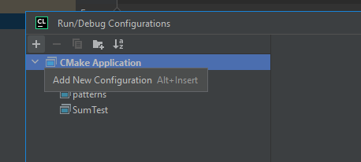
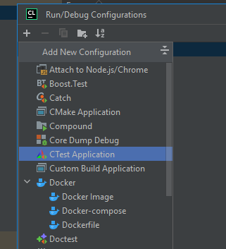

## Быстрый поиск изоморфных подграфов


В данном репозитории размещен алгоритм быстрого поиска подграфов изоморфных
заданному паттерну с помощью минимального отсечения. Более подробное описание можно прочитать 
[на хабре](https://habr.com/ru/post/723328/)

Интерфейс метода, реализующий алгоритм быстрого поиска следующий:

```cpp
std::vector<CombinatoricsData> 
fastGetAllPatterns(int **source, int sourceSize, int **pattern, int patternSize, bool hardCheck);
```

Этот метод возвращает список объектов класса `CombinatoricsData`. Этот класс представляет
собой обёртку над целочисленным массивом. Для реализации быстрого поиска
она не обязательна, однако с её помощью проще реализовывать логику.

Метод возвращается список обёрнутых массивов, каждый из которых
хранит последовательность индексов. Если по этой последовательности построить подматрицу (будем называть
её **переставленной подматрицей**), тогда
граф построенный из предположения, что полученная матрица является матрицей связности, будет
изоморфным графу, построенному по матрице связности графа-паттерна.

В качестве аргументов метод принимает матрицу связности исходного графа `source`, матрицу связности
искомого паттерна `pattern` и флаг жёсткой сверки `hardCheck`.
Если `hardCheck` равен `false`, то нулевому элементу паттерна
может соответствовать произвольное значение в переставленной подматрице, а если
`true`, то все элементы паттерна и переставленной подматрицы должны
совпадать с точностью до перестановки.


### Тесты

Чтобы запустить тесты в `CLion`, нужно 

Выбрать пункт `Edit Configuraions...`


После этого нажать на `+`



И выбрать `CTest Application`


